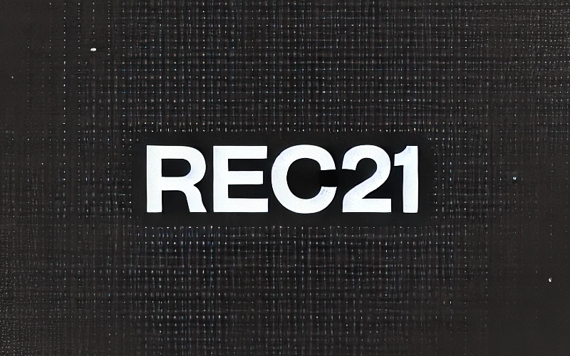

<h1 align="center">Neural 3D Reconstruction for 21-cm Tomographic Data</h1>

<p align="center">
  
</p>

<p align="center">
  <strong>Author:</strong> Nash Sabti<br>
  <strong>Paper:</strong> A Generative Modeling Approach to Reconstructing 21-cm Tomographic Data
</p>

<p align="center">
<kbd>
  
</kbd>
</p>


## How to Use the Code

1. **Data Generation**

   21-cm lightcones can be generated by running the following script:
     ```python
     cd data_generation
     python run_21cmfast.py
     ```
     Each run will create 10 lightcones in a .npy file. We run this a total of 2500 times to create 25,000 boxes.

3. **Data Processing**
     ```python
     python wedge_removal_and_augmentation.py
     ```
     This script augments the data to create 100,000 lightcones and removes modes in the wedge. Output is a 1.5TB hdf5 file with original and wedge-filtered lightcones.

4. **Model Training**
     ```python
     python run.py
     ```

5. **Sample Generation**
     
    Set
     ```python
     train_from_scratch=False
     write_samples=False
     ```
     to create a plot of the lightcone reconstruction, otherwise
     ```python
     train_from_scratch=False
     write_samples=True
     N_samples=1000
     ```
     to generate samples and save them.

7. **Plotting**

     To recreate plots in the paper, run the files in the plotting folder:
     ```python
     cd plotting
     ```

## Contact

For any questions, please contact: [nash.sabti@gmail.com](mailto:nash.sabti@gmail.com)
